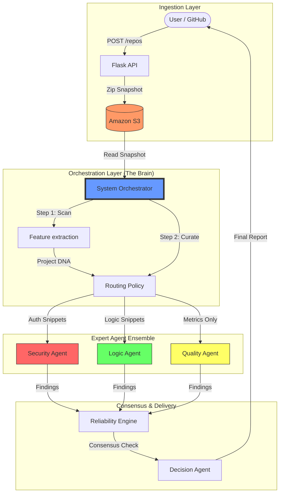

# TrustLens: Multi-Agent AI Code Review System

## 🕵️‍♂️ Overview
TrustLens is a next-generation code analysis platform that moves beyond traditional "single-prompt" AI reviewers. It utilizes a **Multi-Agent Orchestration Architecture** to evaluate codebases for security, logic, and quality through competitive debate and consensus. 

By treating code review as a multi-perspective problem, TrustLens provides explainable, high-confidence audits that identify subtle vulnerabilities and logical contradictions that standard static analysis tools and generic LLMs often miss.

---

## 🏛️ System Design & Architecture

### 🔄 Data Flow & Agent Orchestration
TrustLens uses a "Gateway" pattern where agents never interact with the raw storage directly, ensuring maximum security and data privacy.

### 1. The Immortality Principle (Storage & Isolation)
Security starts with data integrity. TrustLens implements an **Immutable Snapshot Pattern**:
*   **Ingestion**: When a GitHub URL or a code snippet is received, it is immediately cloned into a sandbox and transformed into a zip package.
*   **Isolation**: This package is uploaded to **Amazon S3**. 
*   **Security Barrier**: The analysis agents **never** have direct access to the live repository or S3. They operate purely on "Curated Payloads" provided by the Orchestrator, preventing unauthorized file access or broad data exfiltration.

### 2. The Brain: Policy-Driven Orchestration
The Orchestrator acts as the "Air Traffic Controller" of the system. It follows a strict **Deterministic Routing Policy**:
*   **Feature Extraction**: A specialized agent scans the codebase (LOC, Tech Stack, Tree-Sitter parsing) to build a "Project DNA".
*   **Bounded Context**: Instead of feeding the entire codebase to an LLM (which introduces noise and high cost), the Orchestrator selects only the most "risky" snippets (e.g., auth flows for the Security Agent, loops for the Logic Agent).

### 3. The Expert Ensemble (Agent Layer)
TrustLens deploys five specialized agents, each with a unique persona and evaluation criteria:
*   **Security Agent**: Focuses on OWASP Top 10, SQL Injections, and Cryptographic weaknesses.
*   **Logic Agent**: Analyzes control flows to detect infinite loops, unreachable code, and semantic contradictions.
*   **Quality Agent**: A deterministic agent that evaluates maintainability, nesting depth, and cognitive complexity.
*   **Feature Agent**: Provides high-level context, identifying architectural patterns and tech stack DNA.
*   **Decision Agent**: The final judge. It weighs the findings of all other agents to produce a final recommendation.

### 4. Reliability Engine & Consensus
TrustLens doesn't just give an answer; it calculates **Confidence Scores**.
*   **Divergence Detection**: If the Security Agent flags a risk but the Logic Agent says the code is valid, the system detects a **Conflict**.
*   **Safety Gates**: If the overall confidence is below a defined threshold or a critical conflict is found, the system **Defers** to a Human-in-the-Loop, preventing automated mistakes in high-risk environments.

---

## 💎 Advanced Features

### 🚀 Live Intelligence Feed
During analysis, the UI provides a real-time stream of agent activity. You can watch as each agent "wakes up," processes its curated snippets, and submits its verdict.

### 🧬 Project DNA Mapping
The system generates a visual fingerprint of your project’s architecture, highlighting:
*   **Language Composition**: Dominant languages and their footprint.
*   **Complexity Heatmap**: Detection of deeply nested architectural bottlenecks.
*   **Source Statistics**: Precise LoC and file count metrics.

### 📑 Technical Deep Dive
Every finding in the report is linked to **Real Code Evidence**:
*   **Syntax Highlighting**: Beautifully rendered code blocks for Python, JS, Java, and TypeScript.
*   **Exact Traceability**: Every vulnerability report includes the specific filename and line number.
*   **AI Reasoning**: Detailed explanations of *why* the code was flagged and how it differs from best practices.

---

## 🛠️ Technology Stack
*   **Frontend**: React 19, Vite, Tailwind CSS, Framer Motion (Animations), Lucide (Icons).
*   **Backend**: Flask (Python), REST API Architecture.
*   **AI Intelligence**: Google Gemini 1.5 Flash/Pro with structured JSON output.
*   **Data Infrastructure**: AWS S3 for code snapshotting, GitPython for repository ingestion.
*   **Visuals**: Prism Code Highlighting for professional audit presentation.

---

## 🎯 The Mission
TrustLens aims to solve the **"Black Box"** problem of AI. By moving to a multi-agent model with a deterministic pipeline, we ensure that AI code review is **Structured**, **Explainable**, and **Safe**.
